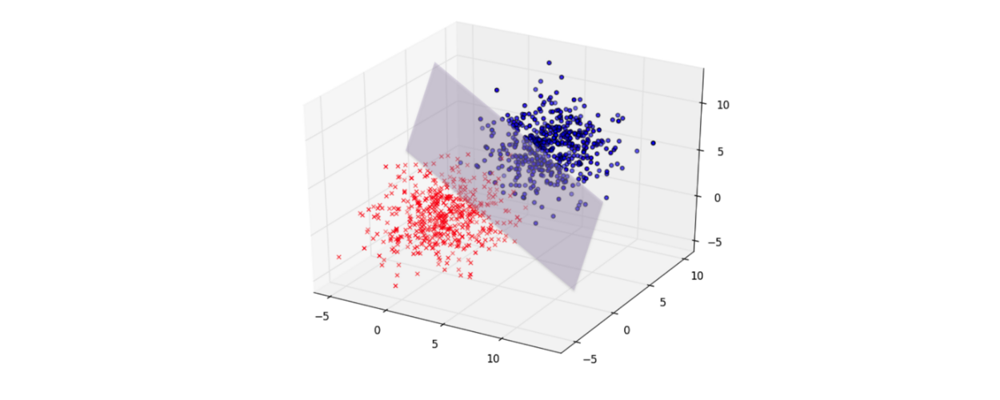
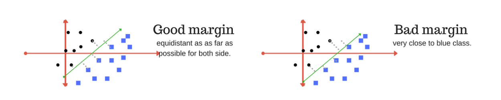
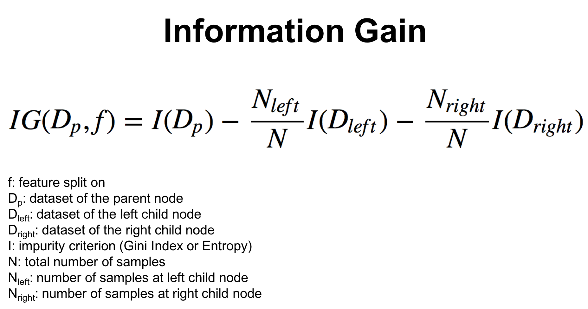
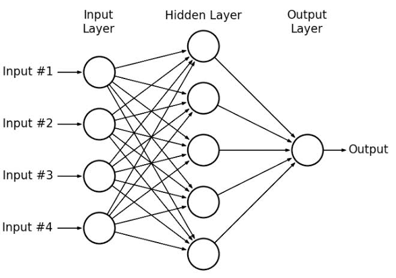
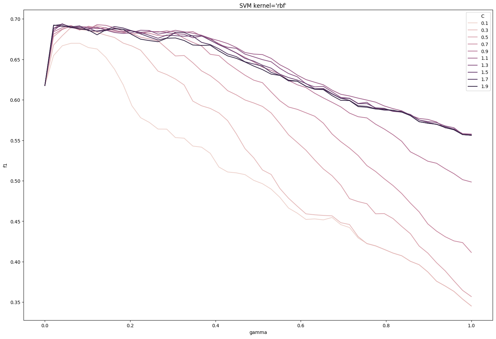

# Music Genre Classification

## Introduction

### What is it exactly?


This project has a simple aim: **determine the genre of a song based only on its audio characteristics** (no meta-data). These characteristics are for example tempo, 

This problem is a *classification* problem: for each song, we need to attribute a class (a genre). Today, classification problems are solved using *machine learning* approaches, which have proved to be quite successful in extracting trends and patterns from large datasets. More specifically, our problem is a *supervised* classification problem: the model will learn from labeled data (i.e. each example song has a determined genre associated to it).

The classes in our problem are: *blues, classical, country, disco, hip-hop, jazz, metal, pop, reggae* & *rock*.

The whole project is and relies on **open source code**.

### What has been done before

Genre classification is widely used these days, and there are already many studies on the subject. Here are the most similar to ours:

- Well-known study using a similar dataset, but with no real machine learning technique: Tzanetakis, George & Cook, Perry. (2002). *Musical Genre Classification of Audio Signals*. IEEE Transactions on Speech and Audio Processing. 10. 293 - 302. 10.1109/TSA.2002.800560
- Using this very dataset, a study was made on this [github repository](https://github.com/Insiyaa/Music-Tagging), achieving a 63% accuracy.
- Out of the 4 public kernels on Kaggle that used this dataset, the best result had 66% accuracy (https://www.kaggle.com/luiscesar/svm-music-classification). 
  

## Dataset & tools

### The data

The data is available on the Kaggle dataset [Music Features](https://www.kaggle.com/insiyeah/musicfeatures), shared by *Insiyah Hajoori*, first published on [MARSYAS](http://marsyas.info/). 

It has been built from 1000 30-second audio tracks of 10 different genres, 100 tracks per genre. Each track is a 22050Hz Mono 16-bit audio file in .wav format, and the features present in the dataset have been extracted from the songs using [libROSA](https://librosa.github.io/librosa/) library.


Each song is described by the following features:

**Rhythmic features**

- `tempo` : the speed at which the audio extract is played.
- `beats` : the rhythmic unit of the song.

**Spectral features**

- `chroma_stft` : *Short Time Fourier Transform* of the extract. Determines the sinusoidal frequency and phase content of local sections of the audio extract.
- `rmse` : *Root Mean Square* of the song, basically the average volume of the song 
- `spectral_centroid` : center of mass of the audio spectrum. Can be linked to the brightness of the song.
- `spectral_bandwidth` : range of frequencies present in the song.
- `rolloff` : frequency below which a specified percentage of the total spectral energy (e.g. 85%), lies.
- `zero_crossing_rate` : rate of sign-changes along the signal. Is a key-feature to recognize percussive sounds.
- `mfcc1`, `mfcc2`, `mfcc3`, ...  : *Mel-frequency cepstral coefficients* of the song extract. Can be seen as the "spectrum-of-the-spectrum".

We standardized our features, removing their mean and scaling them to unit variance, because we're comparing variables that have different units. Variables at different scales do not contribute equally to the analysis and might end up creating a bias.

**Feature statistics**

Before standardization:

```
+--------------------+----------+----------+----------+--------------------+
|    Column Name     |   Min    |   Max    |   Mean   | Standard Deviation |
+--------------------+----------+----------+----------+--------------------+
|       tempo        |  54.978  | 234.908  | 119.602  |       28.297       |
|       beats        |   18.0   |  117.0   |  57.138  |       14.226       |
|    chroma_stft     |  0.172   |  0.664   |  0.379   |       0.082        |
|        rmse        |  0.005   |  0.398   |  0.131   |       0.066        |
| spectral_centroid  | 569.931  | 4434.439 | 2201.834 |      715.961       |
| spectral_bandwidth | 897.994  | 3509.579 | 2242.56  |      526.338       |
|      rolloff       | 749.062  | 8676.406 | 4571.702 |      1574.77       |
| zero_crossing_rate |  0.022   |  0.275   |  0.104   |       0.042        |
|       mfcc1        | -552.064 |  42.035  | -144.479 |      100.236       |
|       mfcc2        |  -1.527  | 193.097  |  99.552  |       31.332       |
|       mfcc3        | -89.901  |  56.666  |  -8.922  |       21.695       |
|       mfcc4        | -18.768  |  80.691  |  36.293  |       16.667       |
|       mfcc5        | -38.903  |  31.462  |  -1.147  |       12.223       |
|       mfcc6        | -28.425  |  45.173  |  14.634  |       11.841       |
|       mfcc7        | -32.934  |  21.836  |  -5.13   |       9.942        |
|       mfcc8        | -24.948  |  49.019  |  10.12   |       10.464       |
|       mfcc9        | -31.653  |  19.129  |  -6.996  |       8.284        |
|       mfcc10       | -12.051  |  27.217  |   7.73   |       7.938        |
|       mfcc11       | -28.052  |  17.421  |  -6.021  |       6.819        |
|       mfcc12       | -15.805  |  23.038  |  4.472   |       6.717        |
|       mfcc13       | -27.542  |  13.054  |  -4.797  |       6.171        |
|       mfcc14       | -12.599  |  18.162  |  1.782   |       5.009        |
|       mfcc15       | -17.545  |  12.358  |  -3.87   |       4.874        |
|       mfcc16       | -15.694  |  13.469  |  1.148   |       4.579        |
|       mfcc17       | -17.228  |  11.49   |  -3.967  |       4.551        |
|       mfcc18       | -11.976  |  15.379  |  0.507   |       3.869        |
|       mfcc19       | -18.504  |  14.687  |  -2.329  |       3.756        |
|       mfcc20       | -19.935  |  15.369  |  -1.095  |       3.838        |
+--------------------+----------+----------+----------+--------------------+
```

After standardization:

```
+--------------------+--------+-------+------+--------------------+
|    Column Name     |  Min   |  Max  | Mean | Standard Deviation |
+--------------------+--------+-------+------+--------------------+
|       tempo        | -2.285 | 4.077 | 0.0  |       1.000        |
|       beats        | -2.753 |  4.21 | 0.0  |       1.000        |
|    chroma_stft     | -2.534 |  3.49 | 0.0  |       1.000        |
|        rmse        | -1.914 | 4.068 | 0.0  |       1.000        |
| spectral_centroid  | -2.28  |  3.12 | 0.0  |       1.000        |
| spectral_bandwidth | -2.556 | 2.408 | 0.0  |       1.000        |
|      rolloff       | -2.429 | 2.608 | 0.0  |       1.000        |
| zero_crossing_rate | -1.96  | 4.094 | 0.0  |       1.000        |
|       mfcc1        | -4.068 | 1.862 | 0.0  |       1.000        |
|       mfcc2        | -3.228 | 2.987 | 0.0  |       1.000        |
|       mfcc3        | -3.734 | 3.025 | 0.0  |       1.000        |
|       mfcc4        | -3.305 | 2.665 | 0.0  |       1.000        |
|       mfcc5        | -3.091 | 2.669 | 0.0  |       1.000        |
|       mfcc6        | -3.638 |  2.58 | 0.0  |       1.000        |
|       mfcc7        | -2.798 | 2.714 | 0.0  |       1.000        |
|       mfcc8        | -3.353 | 3.719 | 0.0  |       1.000        |
|       mfcc9        | -2.978 | 3.155 | 0.0  |       1.000        |
|       mfcc10       | -2.493 | 2.456 | 0.0  |       1.000        |
|       mfcc11       | -3.232 | 3.439 | 0.0  |       1.000        |
|       mfcc12       | -3.02  | 2.765 | 0.0  |       1.000        |
|       mfcc13       | -3.688 | 2.894 | 0.0  |       1.000        |
|       mfcc14       | -2.872 | 3.271 | 0.0  |       1.000        |
|       mfcc15       | -2.807 | 3.331 | 0.0  |       1.000        |
|       mfcc16       | -3.68  | 2.692 | 0.0  |       1.000        |
|       mfcc17       | -2.915 | 3.398 | 0.0  |       1.000        |
|       mfcc18       | -3.228 | 3.846 | 0.0  |       1.000        |
|       mfcc19       | -4.309 | 4.533 | 0.0  |       1.000        |
|       mfcc20       | -4.912 | 4.292 | 0.0  |       1.000        |
+--------------------+--------+-------+------+--------------------+
```

### The tools


The tools used in this project are Python and `scikit-learn` along with `pandas` and `numpy` for data analysis, and `matplotlib` for data visualization. 


## Processing and analysis of the data

### Pre-processing

The main processing of the raw (audio) data has been done upstream, as the dataset already contains the features wanted. 

The processing of the songs is made using the [libROSA](https://librosa.github.io/librosa/) open source library, that allows to extract spectral and rhythm features from audio files. This extraction step will be necessary if we want to add other songs to the dataset.

## Choosing the model

### The mathematical theory behind the models used

Given that out problem is a classification problem, the models we will use are called *classifiers*.

#### Linear models

##### Naive Bayes

The Naive Bayes classifier is based on the Bayes theorem:


This theorem allows to find the probability of A happening, given that B has occurred. The main hypothesis of the Naive Bayes classifier is that the features are independent, that is, there is no correlation between the variables (that is why it is called *naive*).

Applied to a dataset, the formula looks like this - with *y* the predicted class and *x1, x2, ...* the variables of the problem:


We are looking to **maximize this probability**, that is, find the class which *y* has the highest probability to belong to.

The denominator being the same for every entry, we can focus on the numerator.


Then, the output class will be the one that maximizes this quantity:

One of the most used Naive Bayes classifiers is the *Gaussian Naive Bayes*, that makes the assumption that the variables are normally distributed (i.e. their distribution follow a Gaussian curve). In this case, the probability distribution of *xi* given a class *y* is the following one:


##### Logistic Regression

Logistic Regression is inspired by linear regression, but uses a specific cost function called the *Sigmoid function*, or *logistic function*, that is as follows:


We can see that the sigmoid function has its values between 0 and 1, so that its output can be considered as a probability. By defining a decision boundary, the output of the function allows to determine if an observation should be classified as belonging to a class or not.

The cost function is also different from the one of a linear regression (to ensure it to be convex - and be sure to find a global minimum), and is defined as follows:


The minimization of this cost function is done by using *gradient descent*.

##### Support Vector Machine (SVM) with linear kernel

Support Vector Machines is a family of classifiers whose goal is to find a **hyperplane** in an N-dimensional space (N being the number of variables) that distinctly classifies the entries.



The objective here is to find the hyperplane that maximizes the margin between the data points of the 2 classes.



The separating hyperplane is defined as follows (*w* being a weight vector, *x* the input vector and *b* the biais):


In order to maximize the margin, we need to minimize *||w||*: it is a constrained optimization problem, that can be solved by the Lagrangian multiplier method.

The learning of the hyperplane is done by using a ***kernel***, that is, in linear SVM, a linear function. Basically, kernel functions are used to map the original dataset into a higher dimensional space (where the data is linearly separable). This is known as the *kernel trick*.

There are many types of kernel functions, the most used being the *linear, polynomial, radial basis function (RBF)* and *sigmoid* ones. Basically, any symmetric positive semi-definite function could be used as a kernel function. The polynomial, RBF and sigmoid kernels are non-linear, and will be treated in the following section.

The linear kernel is defined as follows:


#### Non-linear models

##### Decision Tree

Decision trees are statistical models that use supervised training for data classification and prediction. For its construction, a training set consisting of inputs and outputs is used, in which the outputs are the classes.
The process of building the tree model is called induction, and may require a lot of computational power. The purpose of the decision tree is to make several divisions of the data into subsets, so that the subsets become increasingly pure. 

In other words, decision trees are split on the feature and split point that result in the largest information gain (IG) for a given criterion (Gini or Entropy, for example).



Where the impurity can be:


##### Random Forest

The Random Forest algorithms creates an ensemble of decision trees, in most cases, trained with the bagging method. The main idea of the bagging method is that the combination of learning models increases the overall result. Simply put: the random forest algorithm creates several decision trees and combines them to obtain a more accurate and more stable prediction.

Differently from the Decision Tree, that usually uses information gain and entropy calculations, Random Forest does this at random. Another difference is that, while deep decision trees can suffer from overfitting,  Random Forests avoid overfitting in most cases. The overfitting is lower because RFs work with random subsets of features and build smaller trees from such subsets. After training, the subtrees are combined.


##### Support Vector Machine (SVM) with non-linear kernel

Non-linear SVM follow the same principle than linear SVM, but use non-linear kernels, most frequently one of the following:

- the polynomial kernel


- the Gaussian Radial Basis Function (RBF) kernel

  

- the sigmoid kernel

  
  

The SVM with RBF kernel is the most used because of its good performance and adaptability to various datasets.

It has two main hyper-parameters: C and gamma.

**C** is a factor controlling the cost of misclassification on the training data. Therefore, a small C (C << 1) means a more simple model, allowing more misclassified entries but limiting the risk of over-fitting. On the contrary, a large C (C > 1) forces the model to explain strictly the entries by reaching a really low misclassification rate, potentially over-fitting. 

**Gamma** is the parameter of the Gaussian radial basis function (1/2sigma² here). A very small gamma will constrain the model and cause a large variance, where a large gamma will lower the variance but raise the bias. In ``scikit-learn`, we also have the value `scale`  as a option for gamma, in which case, `gamma = 1 / (n_features * X.var())`.  


##### K-Nearest Neighbors (k-NN)

KNN is a nonparametric algorithm, and the model structure will be determined by the used dataset. This algorithm is also known as slow learning or a lazy algorithm. Lazy algorithms do not require training data to generate the model, which speeds up the initial process, but in turn will generate a need for further analysis. 

In this algorithm we have a variable called K, which is the main parameter to be selected. This parameter will decide the number of neighbors. If we have a value "P" that we want to know which class it belongs to, first we identify the closest point to it and then which class it's in. After identifying the nearest point and its class, we will predict in which class the point "P" belongs. In order to do that, a poll is conducted, and the majority of points will tell which class this point "P" actually belongs to.

KNN’s main disadvantage is becoming slower as the volume of data increases, which makes it an impractical choice in environments where predictions need to be made rapidly.


##### Multi Layer Perceptron (MLP)

To understand a multi layer perceptron, first, it's important to understand what a perceptron is. A perceptron, or neuron, is a node that processes signals inside a network. It sums up the inputs multiplied by their weights, and adds a bias (that provides one more degree of freedom), to produce a weighted net sum. This sum is then applied to an activation function, which standardizes the value, producing an output of 0 or 1. 

These perceptrons can form a network of multiple layers, working together to successfully classify inputs, by passing to the following layer the information on whether a feature is present (1) or not (0), and then this next layer will process the information received from the previous one. That is what constitutes a Multi Layer Perceptron (MLP)

The MLP is used when classes are not linearly separable, and this model generates more than one classifying line.

Learning in this type of network is usually done with the aid of the error backpropagation algorithm, but there are other algorithms for this purpose.

Each network layer has a specific function. The output layer receives stimuli from the last of the intermediate layers and builds the response.




### Implementation and comparison of models

All the models have been implemented using the `scikit-learn` library.

To compare the models while using cross-validation, we used the `StratifiedKFold` function to generate the K-folds of the cross validation process, using 10 as the number of splits.

To ensure the train and validation datasets are the same for each model, we set the `random_state` at a constant value for each comparison. 

``` python
# Simplified code for the cross-validation process
def cross_validation(clf, X, y, random_state):
    cv = StratifiedKFold(n_splits=10, random_state=random_state, shuffle=False)
    scores = cross_val_score(clf, X, y, cv=cv, scoring='accuracy')
    return scores.mean()

classifiers = [SVC(kernel='poly'), SVC(kernel='rbf'), kNN(n=7), ...]

for classifier in classifiers:
    cross_validation(classifier, X, y, random_state=42)
```

This cross validation routine allows to compare the performance of the models, tuned with default or simple parameters, and thus determine which one is the "apparently best" model. The accuracy score for one specific classifier is calculated using the mean value of the scores obtained for each fold. 

We also tried to concatenate all labels predicted by the cross validation and then compare them with the original labels from the dataset, to get an accuracy score based on all the 1,000 entries instead of 100 entries on each fold, but surprisingly, this didn't give us better results -- the scores remained the same.

This overall comparison gave us a quick idea on the most adapted models for our problem.

The next step was to choose the "apparently best models", and tune their parameters to reach better performance.

### Parameter tuning

Once the "apparently best" models have been chosen, one would like to find the set of parameters that can optimize their performance for the problem we're dealing with. These parameters are in fact called *hyper-parameters*, in opposition to the parameters of the cost-function that are optimized during the learning process. More on the parameter tuning for each model will be described in the Results section.


## Results

### Visualization and characterization of the data

At first, when plotting the scatter plot, the data is difficult to analyze because of the many variables we're working with. 


From the beginning, it seemed that our classes are not easily separable on any of the variables, as it was expected. Indeed, since it is a projection in a bi-dimensional plane, the data appear more mixed up than they are in reality, especially for classification problems. 

Because of the number of features, we also chose to analyze the correlation matrix.


This plot shows that `tempo` and `beats` are highly correlated, as well as `chroma_stft`, `rmse`, `spectral_centroid`, `spectral_bandwidth`, `roloff`, `zero_crossing_rate` and `mfcc1`, which explains the scatter plot. Features from `mfcc2` to `mfcc20` are weakly correlated.


Then, we wanted to understand if our dataset had any outliers, so we plot a distance matrix using Euclidean distances, but we didn't find any particular outliers, so there was nothing to be removed.


Also, there were no missing values, and our problem was balanced, so we were ready to work with it.

To make our dataset more separable, we decided to transform our data into components where classes were supposed to be more apart from each other.

First, we tried PCA, but since the transformation performed by the ACP does not take into account class information, it was not the most effective for class separation, as it is possible to see in the image below.


Then, we tried LDA, which was more effective, because it takes class information into account for the transformation, such that, in the new coordinate space, the separation between classes is maximum. After the LDA transformation, the 20 variables reduced to 9, because the number of transformed variables in the LDA is the number of classes of the original problem (10) minus 1.


With this plot, the separation between classes became more evident, even though the data is not linearly separable.


### Results of the trained models

Thanks to the cross validation routine, we could compare the performance of the models, first with the default parameters. The scores printed here are the accuracy scores of each model.

The results for the dataset before the LDA transformation were:

```
0.639 Random Forest · 100 estimators
0.421 Naive Bayes
0.629 Logistic Regression · Solver:'sag'
0.650 Linear SVM
0.553 SVC · kernel='poly' · degree=2 · gamma='scale'
0.663 SVC · kernel='rbf' · gamma='scale' · C=1
0.462 SVC · kernel='sigmoid' · gamma='scale'
0.492 Decision Tree 
0.619 Knn · 5 neighbors
0.624 Knn · 7 neighbors
0.632 Knn · 9  neighbors
0.573 MLP · hidden_layer_sizes=(8,8,8) · activation='relu' · solver='adam' · max_iter=3000
```

The results for the dataset after the LDA transformation were:

```
0.668 Random Forest · 100 estimators
0.660 Naive Bayes
0.676 Logistic Regression · Solver:'sag'
0.674 Linear SVM
0.629 SVC · kernel='poly' · degree=2 · gamma='scale'
0.700 SVC · kernel='rbf' · gamma='scale' · C=1
0.635 SVC · kernel='sigmoid' · gamma='scale'
0.506 Decision Tree 
0.653 Knn · 5 neighbors
0.661 Knn · 7 neighbors
0.664 Knn · 9  neighbors
0.629 MLP · hidden_layer_sizes=(8,8,8) · activation='relu' · solver='adam' · max_iter=3000
```


Given this first comparison, the model that seemed to work best with our data was the ***SVC with rbf kernel***. We were also surprised by the low performance of the Multi Layer Perceptron, and wanted to see if it could go better with tuned parameters. We applied a Grid Search to both SVC and MLP, and both improved their accuracy. For the other models, we tuned the parameters by iterating over a certain margin, and our parameter choices are explained in the next section for each model. 

But first, we present here a table with the models that were modified by parameter tuning (not every model was tuned, because some didn't allow this possibility), and their results for both datasets, before and after the LDA transformation, while using the best parameters for each model. We only show here the models that have actually improved with the parameter tuning, because for example, the SVC with polynomial kernel and sigmoid kernel didn't improve by changing the parameters. 

Before the LDA transformation:

```
0.659 Random Forest · 200 estimators
0.697 SVC · kernel='rbf' · gamma='0.1' · C=1.7
0.506 Decision Tree · Entropy · max_depth=17 
0.638 Knn · 8 neighbors
0.642 MLP · hidden_layer_sizes=(20,20,20) · activation='tanh' · solver='adam' · 'learning_rate': 'adaptive'
```

After the LDA transformation:

```
0.679 Random Forest · 350 estimators
0.700 SVC · kernel='rbf' · gamma='0.0001' · C=1
0.560 Decision Tree · Entropy · max_depth=8 
0.682 Knn · 28 neighbors
0.654 MLP · hidden_layer_sizes=(20,20,20) · activation='tanh' · solver='adam' · 'learning_rate': 'adaptive'
```


### Comparison and discussion of the results

#### Linear models

**Naive Bayes**

The Naive Bayes algorithm gave us an accuracy of 42.1% without the LDA and 66.0% with the LDA. This increase of accuracy can be explained because some of the original variables very correlated, and the Naive Bayes algorithm assumes the features are independent, so after the LDA transformation, the 9 new variables are less correlated, and thus, the algorithm works better. Neither of these results is optimal, though, because we used the Gaussian Naive Bayes, which assumes that the variables have a Gaussian distribution and while most of them are distributed that way, not all of them are.

**Logistic Regression**

The Logistic Regression algorithm gave us an accuracy of 62.9% without the LDA and 67.6% with the LDA. It is not that bad without the LDA because this algorithm does not assume that the features are not correlated, so that is not a problem.

**Support Vector Machine (SVM) with linear kernel**

The SVM with linear kernel algorithm gave us an accuracy of 65.0% without the LDA and 67.4% with the LDA. As expected, using a linear kernel, the SVM has performed comparably to the Logistic Regression.


#### Non-linear models

**Decision Tree**

Our Decision tree had the lowest accuracy of all the algorithms we used, with 56.0% of accuracy with LDA and 50.6% without it. 

On the original dataset (before LDA transformation), the best parameters were maximum depth of 17 and Gini as criterion.

For the LDA, we tuned the parameters of criterion and maximum tree depth, and got this result of 56.0% using maximum depth of 8 and Entropy as criterion. 

It makes sense that the optimum depth is bigger on the original dataset than on the LDA-transformed one, because it has more variables (20), while the LDA-transformed one has only 9.

**Random Forest**

The Random Forest algorithm provided an accuracy of 65.9% on the original dataset and 67.9% on the LDA-transformed dataset.

The parameter tuning was made only by changing the number of forests, and the best parameter was 200 forests for the original dataset and 350 for the one with LDA. 

It is important to notice that, on the dataset with LDA, the difference of accuracy between 200 forests (67.7% acc) and 350 (67.9% acc) was 0.2%, so even though the result might have become a little bit more accurate with even more forests, the improvement probably wouldn't be enough to justify spending the additional computational resources and time for the calculation of more forests.

**KNN**

For the KNN algorithm, we ran the algorithm many times with cross validation technique, and changing the number of neighbors from 1 to 30, both with LDA and without LDA. We found the best number of neighbors for this algorithm in our dataset to be 28 neighbors, which provided an accuracy of 68.2% with the LDA.

Since 28 is not a small number for our 1000-entry dataset, we considered it safe enough to think of this as a valid result, as overfitting in KNN usually happens when the number of neighbors is too low.
Without LDA, out best result was with 8 neighbors, providing an accuracy of 63.8%.

**Support Vector Machine (SVM) with polynomial kernel**

62.9% with degree=2 and gamma='scale' (LDA)

55.3% with degree=2 and gamma='scale' (original dataset)

**Support Vector Machine (SVM) with RBF (Gaussian) kernel**

Using a grid search, we were able find the best set of parameters C and gamma, and **reached a 70% accuracy** (69.7% without the LDA step). Here is an example of the Grid Search for the original dataset.

For the LDA, the best result we achieved (70%) was with gamma='0.001', which is equivalent to the 'scale' parameter, and C=1. The Grid Search also optimized the results for the original dataset, going from 66.3% to 69.7% when using gamma=0.1 and C=1.7.



**Support Vector Machine (SVM) with sigmoid kernel**

63.5% with gamma='scale' (LDA)

46.2% with gamma='scale' (original dataset)


**Multi Layer Perceptron**

The MLP remained under the best default-parametrized models, with a accuracy of 65.4% for the LDA-transformed dataset and 64.2% for the original dataset. 


## Conclusions

### Discussion on the characteristics of the problem

- Few training examples
- Classifications of genres are often arbitrary and controversial
- The prediction is based exclusively on spectral and rhythm characteristics of the songs - is it enough to determine a genre? Jazz songs for instance have many different tonalities and rhythms, where classical songs for example are more consistent between each other. This is certainly one of the reasons why the model has more ease to predict accurately classical songs than jazz ones. ("*The best predicted genres are classical and hip-hop while the worst predicted are jazz and rock*" - Tzanetakis, George & Cook study (2002))

### What's the best model?


### Possible improvements

- subgenres (hierarchical structure)

------

Course: *Inteligência Computacional (COC 361)* - Universidade Federal do Rio de Janeiro