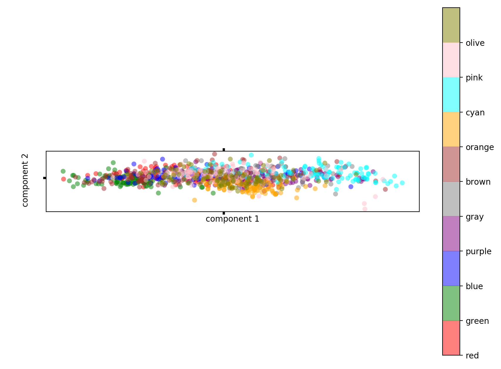
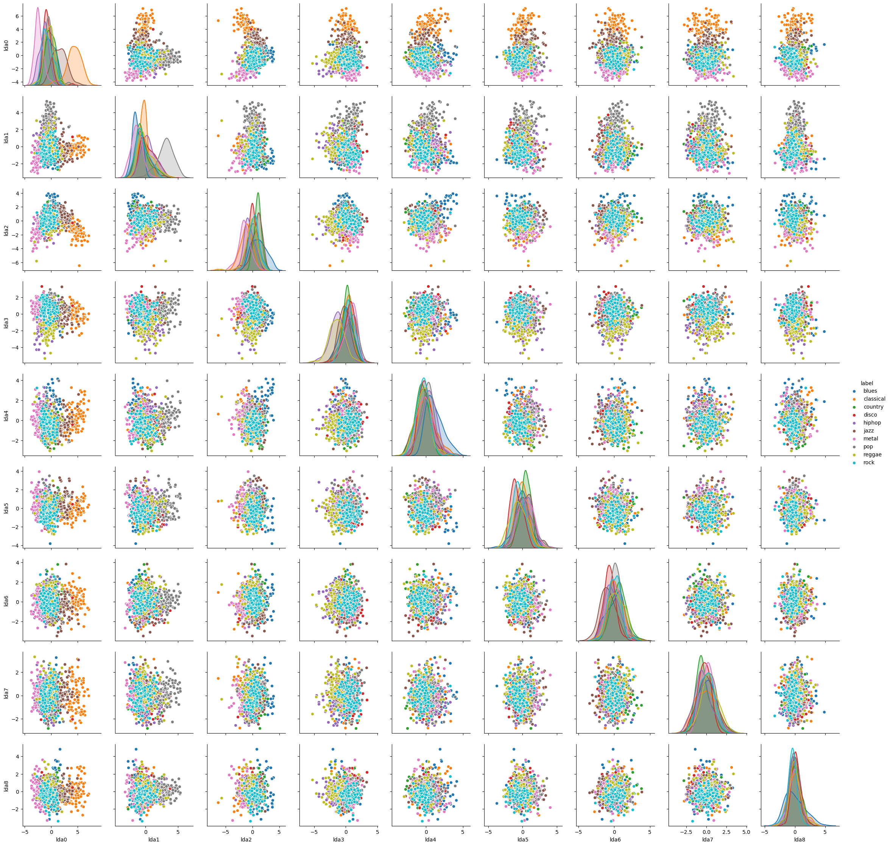
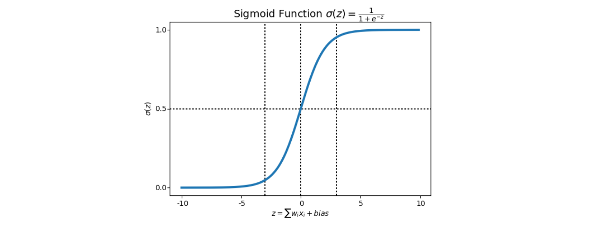
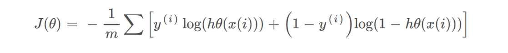

# Music Genre Classification

## Introduction

### What is it exactly?

This project has a simple aim: **determine the genre of a song based only on its audio characteristics** (no meta-data). These characteristics are for example tempo, 

This problem is a *classification* problem: for each song, we need to attribute a class (a genre). Today, classification problems are solved using *machine learning* approaches, which have proved to be quite successful in extracting trends and patterns from large datasets. More specifically, our problem is a *supervised* classification problem: the model will learn from labeled data (i.e. each example song has a determined genre associated to it).

The classes in our problem are: *blues, classical, country, disco, hip-hop, jazz, metal, pop, reggae* & *rock*.

The whole project is and relies on **open source code**.

### What has been done before

Genre classification is widely used these days, and there are already many studies on the subject. Here are the most similar to ours:

- Well-known study using a similar dataset, but with no real machine learning technique: Tzanetakis, George & Cook, Perry. (2002). *Musical Genre Classification of Audio Signals*. IEEE Transactions on Speech and Audio Processing. 10. 293 - 302. 10.1109/TSA.2002.800560
- Using this very dataset, a study was made on this [github repository](https://github.com/Insiyaa/Music-Tagging), achieving a 63% accuracy.
- Out of the 4 public kernels on Kaggle that used this dataset, the best result had 66% accuracy (https://www.kaggle.com/luiscesar/svm-music-classification). 
  

## Dataset & tools

### The data

The data is available on the Kaggle dataset [Music Features](https://www.kaggle.com/insiyeah/musicfeatures), shared by *Insiyah Hajoori*, first published on [MARSYAS](http://marsyas.info/). 

It has been built from 1000 30-second audio tracks of 10 different genres, 100 tracks per genre. Each track is a 22050Hz Mono 16-bit audio file in .wav format, and the features present in the dataset have been extracted from the songs using [libROSA](https://librosa.github.io/librosa/) library.

Each song is described by the following features:

**Rhythmic features**

- `tempo` : the speed at which the audio extract is played.
- `beats` : the rhythmic unit of the song.

**Spectral features**

- `chroma_stft` : *Short Time Fourier Transform* of the extract. Determines the sinusoidal frequency and phase content of local sections of the audio extract.
- `rmse` : *Root Mean Square* of the song, basically the average volume of the song 
- `spectral_centroid` : center of mass of the audio spectrum. Can be linked to the brightness of the song.
- `spectral_bandwidth` : range of frequencies present in the song.
- `rolloff` : frequency below which a specified percentage of the total spectral energy (e.g. 85%), lies.
- `zero_crossing_rate` : rate of sign-changes along the signal. Is a key-feature to recognize percussive sounds.
- `mfcc1`, `mfcc2`, `mfcc3`, ...  : *Mel-frequency cepstral coefficients* of the song extract. Can be seen as the "spectrum-of-the-spectrum".

### The tools

The tools used in this project are Python and `scikit-learn` along with `pandas` and `numpy` for data analysis, and `matplotlib` for data visualization. 

## Processing and analysis of the data

### Pre-processing

The main processing of the raw (audio) data has been done upstream, as the dataset already contains the features wanted. 

The processing of the songs is made using the [libROSA](https://librosa.github.io/librosa/) open source library, that allows to extract spectral and rhythm features from audio files. This extraction step will be necessary if we want to add other songs to the dataset.

### Data exploration

At first, we plot the scatter plot, and it was difficult to analyze because of the many variables we're working with. 

From the beginning, it seemed that our classes are not easily separable on any of the variables, as it was expected. Indeed, since it is a projection in a bi-dimensional plane, the data appear more mixed up than they are in reality, especially for classification problems. 

Because of the number of features, we also chose to analyze the correlation matrix.

This plot shows that `tempo` and `beats` are highly correlated, as well as `chroma_stft`, `rmse`, `spectral_centroid`, `spectral_bandwidth`, `roloff`, `zero_crossing_rate` and `mfcc1`, which explains the scatter plot. Features from `mfcc2` to `mfcc20` are weakly correlated.

Then, we wanted to understand if our dataset had any outliers, so we plot a distance matrix using Euclidean distances, but we didn't find any particular outliers, so there was nothing to be removed.

Also, there were no missing values, and our problem was balanced, so we were ready to work with it.

To make our dataset more separable, we decided to transform our data into components where classes were supposed to be more apart from each other.

First, we tried PCA, but since the transformation performed by the ACP does not take into account class information, it was not the most effective for class separation, as it is possible to see in the image below.

Then, we tried LDA, which was more effective, because it takes class information into account for the transformation, such that, in the new coordinate space, the separation between classes is maximum. After the LDA transformation, the 20 variables reduced to 9, because the number of transformed variables in the LDA is the number of classes of the original problem (10) minus 1.

With this plot, the separation between classes became more evident, even though the data is not linearly separable.

## Choosing the model

### The mathematical theory behind the models used

Given that out problem is a classification problem, the models we will use are called *classifiers*.

#### Linear models

##### Naive Bayes

The Naive Bayes classifier is based on the Bayes theorem:

This theorem allows to find the probability of A happening, given that B has occurred. The main hypothesis of the Naive Bayes classifier is that the features are independent, that is, there is no correlation between the variables (that is why it is called *naive*).

Applied to a dataset, the formula looks like this - with *y* the predicted class and *x1, x2, ...* the variables of the problem:

We are looking to **maximize this probability**, that is, find the class which *y* has the highest probability to belong to.

The denominator being the same for every entry, we can focus on the numerator.

Then, the output class will be the one that maximizes this quantity:

One of the most used Naive Bayes classifiers is the *Gaussian Naive Bayes*, that makes the assumption that the variables are normally distributed (i.e. their distribution follow a Gaussian curve). In this case, the probability distribution of *xi* given a class *y* is the following one:

##### Logistic Regression

Logistic Regression is inspired by linear regression, but uses a specific cost function called the *Sigmoid function*, or *logistic function*, that is as follows:

We can see that the sigmoid function has its values between 0 and 1, so that its output can be considered as a probability. By defining a decision boundary, the output of the function allows to determine if an observation should be classified as belonging to a class or not.

The cost function is also different from the one of a linear regression (to ensure it to be convex), and is defined as follows:

The minimization of this cost function is done by using *gradient descent*.

##### Support Vector Machine (SVM) with linear kernel

#### Non-linear models

##### Decision Tree

##### Random Forest

##### Support Vector Machine (SVM) with non-linear kernel

##### K-Nearest Neighbors (k-NN)

Non parametric

##### Gradient boosting

##### Multi Layer Perceptron (MLP)

### Implementation and comparison of models

All the models have been implemented using the `scikit-learn` library.

- Cross-validation

  

### Adjust of parameters

- Grid search
  

## Results

### Results of the linear models

### Results of the non-linear models

Grid-search for SVM and MLP:

MLP:  0.6086271466227942 -> 0.6524276952805088

### Comparison and discussion of the results

- "The best predicted genres are classical and hiphop while the worst predicted are jazz and rock" - Tzanetakis, George & Cook study (2002)

  

## Conclusions

### Discussion on the characteristics of the problem

- Few training examples
- Classifications of genres are often arbitrary and controversial
- The prediction is based exclusively on spectral and rhythm characteristics of the songs - is it enough to determine a genre? Jazz songs for instance have many different tonalities and rhythms, where rock songs for example are more consistent between each other. This is certainly one of the reasons why the model has more ease to predict accurately rock songs than jazz ones.

### What's the best model?

### Possible improvements

- subgenres (hierarchical structure)

------

Course: *Inteligência Computacional (COC 361)* - Universidade Federal do Rio de Janeiro